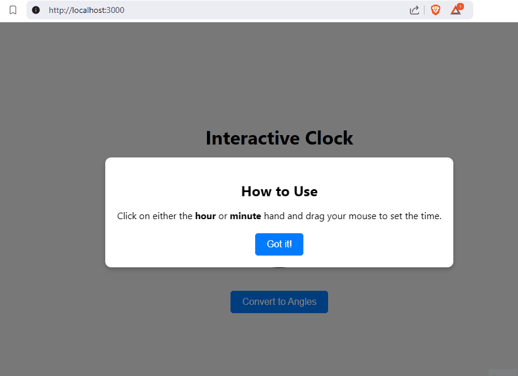
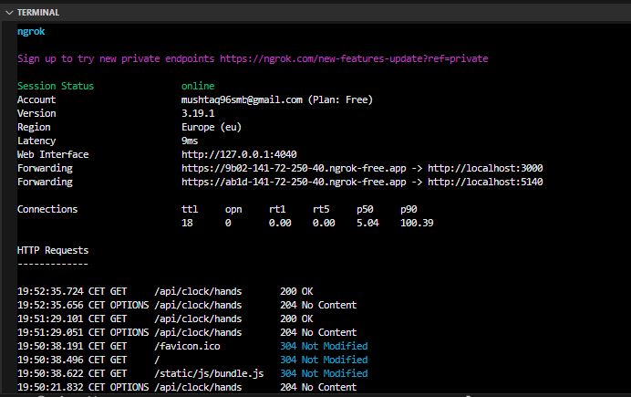

# Interactive Clock with Draggable Hands

## Demo

 

## Project Description

This FE project is an **Interactive Clock** application that allows users to set the time by dragging the hour and minute hands. The selected time is then converted into **hour and minute angles**, which are displayed on the screen. The application also includes a backend API to calculate the angles based on the selected time.

---

## Features

- **Draggable Clock Hands**: Users can click and drag the hour and minute hands to set the time.
- **Real-Time Display**: The selected time is displayed in a user-friendly format (e.g., `03:15`).
- **Angle Calculation**: The backend API calculates the hour and minute angles based on the selected time.
- **Interactive Tutorial**: A modal pops up on the first visit to guide users on how to interact with the clock.
- **Responsive Design**: The UI is centered and works well on different screen sizes.

---

## How to Use

1. **Set the Time**:
   - Click and drag the **hour hand** to set the hour.
   - Click and drag the **minute hand** to set the minutes.

2. **Convert to Angles**:
   - Once the time is set, click the **"Convert to Angles"** button.
   - The hour and minute angles will be displayed below the clock.

3. **Instructions**:
   - On the first visit, a modal will appear with instructions on how to use the clock.
   - Click **"Got it!"** to close the modal.

---

## Setup Instructions

### Prerequisites

- Node.js (v16 or higher)
- npm (v8 or higher)
- Backend API (optional, for angle calculation)

### Frontend Setup

1. Clone the repository:
   ```bash
   git clone https://github.com/mushtaq96/cgi.git
   cd ClockAPI
   cd clock-ui
   ```

2. Install dependencies:
   ```bash
   npm install
   ```

3. Start the development server:
   ```bash
   npm start
   ```

4. Open the app in your browser:
   ```
   http://localhost:3000
   ```

### Backend Setup (Optional)

1. Ensure the backend API is running at `http://localhost:5140`.
2. The API should have the following endpoint:
   ```
   GET /api/clock/hands?hours=<hour>&minutes=<minute>
   ```
   Example:
   ```
   GET /api/clock/hands?hours=3&minutes=15
   ```

---

## Folder Structure

```
clock-ui/
├── public/                  # Static assets
│   ├── index.html           # Main HTML file
│   └── robots.txt           # Robots configuration
├── src/                     # Source code
│   ├── Components/          # React components
│   │   ├── Clock.jsx        # Clock component
│   │   └── DraggableClockHands.jsx # Draggable clock hands component
│   ├── App.js               # Main application component
│   ├── index.js             # Entry point
│   ├── index.css            # Global styles
│   └── reportWebVitals.js   # Performance monitoring
├── README.md                # Project documentation
└── package.json             # Project dependencies
```

---

## Technologies Used

- **Frontend**:
  - React.js
  - CSS (Flexbox for layout)
- **Backend** (optional):
  - ASP.NET Core (for angle calculation API)

## Ngrok Setup (WSL/Ubuntu)

To expose both the frontend and backend to the internet, use ngrok. Here's how to set it up:

1. Install ngrok:
   ```bash
   sudo apt update
   sudo apt install ngrok
   ```

2. Authenticate ngrok with your authtoken:
   ```bash
   ngrok config add-authtoken <your-authtoken>
   ```

3. Create or update the `ngrok.yml` file:
   ```yaml
   version: "3"
   agent:
       authtoken: <your-authtoken>

   tunnels:
     frontend:
       proto: http
       addr: localhost:3000
     backend:
       proto: http
       addr: localhost:5140 
   ```

4. Start ngrok:
   ```bash
   ngrok start --all
   ```
   

5. Update the frontend `fetch` call to use the ngrok backend URL:
   ```js
   fetch(`https://<ngrok-backend-url>/api/clock/hands?hours=${fHour}&minutes=${minute}`, {
     headers: {
       'ngrok-skip-browser-warning': 'true'
     }
   })
   ```

 